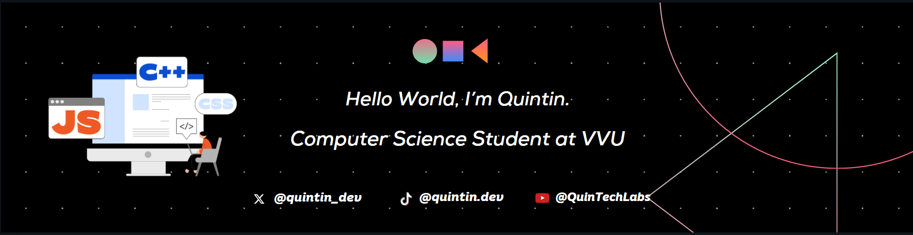

  

## ▪️ About Me ▪️

  

  

## ▪️ My Learning Progress ▪️

 
 

 &nbsp;&nbsp;&nbsp;&nbsp; &nbsp;&nbsp;&nbsp; 
 &nbsp; &nbsp;&nbsp;&nbsp; &nbsp;&nbsp;&nbsp; &nbsp;
 &nbsp;&nbsp;&nbsp; &nbsp; &nbsp;&nbsp;&nbsp; &nbsp;  &nbsp;
 &nbsp;&nbsp;&nbsp; &nbsp;&nbsp;&nbsp;

      
      
      
      
  
   

 &nbsp;&nbsp;&nbsp;&nbsp; &nbsp;&nbsp;
 &nbsp; &nbsp;&nbsp;&nbsp; &nbsp;&nbsp;&nbsp; &nbsp;
 &nbsp;&nbsp;&nbsp; &nbsp; &nbsp;&nbsp;&nbsp; &nbsp;  &nbsp; &nbsp;
 &nbsp;&nbsp;&nbsp; &nbsp;&nbsp;&nbsp;
  

      
      
      
      
 

 

## ▪️ My Projects ▪️

<table align="center" width="100%">
  <thead>
    <tr>
      <th colspan="4" style="text-align:center; font-size: 1.2em;">PERSONAL & UNIVERSITY PROJECTS</th>
    </tr>
    <tr>
      <th style="width:30%; text-align:center;">Project Name</th>
      <th style="width:40%; text-align:center;">Description</th>
      <th style="width:15%; text-align:center;">Technologies</th>
      <th style="width:15%; text-align:center;">Status / Demo</th>
    </tr>
  </thead>
  <tbody>
    <tr>
      <td style="text-align:left;"><a href="https://github.com/Eddking-QS/Projects-eCommerce_App" target="_blank">C++ E-Commerce Console App</a></td>
      <td style="text-align:left;">My 1st year, end of 1st semester C++ project simulating basic e-commerce operations.</td>
      <td style="text-align:center;">C++</td>
      <td style="text-align:center;">N/A (Console)</td>
    </tr>
    <tr>
      <td style="text-align:left;">Portfolio Website</td>
      <td style="text-align:left;">Personal portfolio website currently in development to showcase my skills and projects.</td>
      <td style="text-align:center;">HTML, CSS, JavaScript (Future: React, etc.)</td>
      <td style="text-align:center;">Coming Soon</td>
    </tr>
  </tbody>
</table>

 

<table align="center" width="100%">
  <thead>
    <tr>
      <th colspan="4" style="text-align:center; font-size: 1.2em;">FCC CERTIFICATION PROJECTS (HTML/CSS)</th>
    </tr>
    <tr>
      <th style="width:30%; text-align:center;">Project Name</th>
      <th style="width:40%; text-align:center;">Description</th>
      <th style="width:15%; text-align:center;">Technologies</th>
      <th style="width:15%; text-align:center;">Demo</th>
    </tr>
  </thead>
  <tbody>
    <tr>
      <td style="text-align:left;"><a href="https://github.com/Eddking-QS/FCC-Survey_Form" target="_blank">Survey Form</a></td>
      <td style="text-align:left;">Simple survey form page made with HTML and CSS.</td>
      <td style="text-align:center;">HTML, CSS</td>
      <td style="text-align:center;"><a href="YOUR_LIVE_DEMO_LINK_HERE" target="_blank">[View]</a></td>
    </tr>
    <tr>
      <td style="text-align:left;"><a href="https://github.com/Eddking-QS/Projects-Tribute_Page" target="_blank">Tribute Page</a></td>
      <td style="text-align:left;">A Tribute/Memorial page for a pet dog called Ace.</td>
      <td style="text-align:center;">HTML, CSS</td>
      <td style="text-align:center;"><a href="YOUR_LIVE_DEMO_LINK_HERE" target="_blank">[View]</a></td>
    </tr>
    <tr>
      <td style="text-align:left;"><a href="https://github.com/Eddking-QS/Projects-Technical_Documentation_Page" target="_blank">Technical Documentation Page</a></td>
      <td style="text-align:left;">A blog containing the best tools for each stage in the development cycle.</td>
      <td style="text-align:center;">HTML, CSS</td>
      <td style="text-align:center;"><a href="YOUR_LIVE_DEMO_LINK_HERE" target="_blank">[View]</a></td>
    </tr>
    <tr>
      <td style="text-align:left;"><a href="https://github.com/Eddking-QS/Projects-Product_Landing_Page" target="_blank">Product Landing Page</a></td>
      <td style="text-align:left;">A product landing page for the Samsung Galaxy Watch.</td>
      <td style="text-align:center;">HTML, CSS</td>
      <td style="text-align:center;"><a href="YOUR_LIVE_DEMO_LINK_HERE" target="_blank">[View]</a></td>
    </tr>
    </tbody>
</table>

 

<table align="center" width="100%">
  <thead>
    <tr>
      <th colspan="4" style="text-align:center; font-size: 1.2em;">FCC CERTIFICATION PROJECTS (JAVASCRIPT)</th>
    </tr>
    <tr>
      <th style="width:30%; text-align:center;">Project Name</th>
      <th style="width:40%; text-align:center;">Description</th>
      <th style="width:15%; text-align:center;">Technologies</th>
      <th style="width:15%; text-align:center;">Demo</th>
    </tr>
  </thead>
  <tbody>
    <tr>
      <td style="text-align:left;"><a href="https://github.com/quintin-dev/FCC-Palindrome_Checker" target="_blank">Palindrome Checker</a></td>
      <td style="text-align:left;">A simple Web Page with a Palindrome Checker and a hidden easter egg.</td>
      <td style="text-align:center;">HTML, CSS, JavaScript</td>
      <td style="text-align:center;"><a href="YOUR_LIVE_DEMO_LINK_HERE" target="_blank">[View]</a></td>
    </tr>
  </tbody>
</table>

 
 

<table align="center" width="100%">
  <thead>
    <tr>
      <th colspan="2" style="text-align:center; font-size: 1.2em;">MINI PROJECTS</th> </tr>
  </thead>
  <tbody>
    <tr>
      <td align="center" colspan="2">Click On The Project Name To View</td> </tr>
    <tr>
      <th align="center" style="width:30%;">HTML   CSS   Tailwind CSS</th>
      <td style="width:70%; text-align:left;"> <a href="https://github.com/Eddking-QS/HTML-Mini-Project-CookieMonster" target="_blank">Cookie Monster Portfolio Website</a> &nbsp;▪︎&nbsp;
        <a href="https://github.com/Eddking-QS/HTML-Mini_Projects-CatPhotoApp" target="_blank">Cat Photo App</a> &nbsp;▪︎&nbsp;
        <a href="https://github.com/Eddking-QS/CSS-Mini_Projects-Cafe_Menu" target="_blank">Cafe Menu</a> &nbsp;▪︎&nbsp;
        <a href="https://github.com/Eddking-QS/CSS-Mini_Project-Markers" target="_blank">CSS Color Markers</a> &nbsp;▪︎&nbsp;
        <a href="https://github.com/Eddking-QS/HTML-Mini_Projects-Registration_Form" target="_blank">Registration Form</a> &nbsp;▪︎&nbsp;
        <a href="https://github.com/Eddking-QS/CSS_Mini-Projects_Rothko_Painting" target="_blank">Rothko Painting</a> &nbsp;▪︎&nbsp;
        <a href="https://github.com/Eddking-QS/CSS-Mini_Projects-Gallery" target="_blank">Gallery</a> &nbsp;▪︎&nbsp;
        <a href="https://github.com/Eddking-QS/CSS-Mini_Projects-Nutrition_Label" target="_blank">Nutrition Label</a> &nbsp;▪︎&nbsp;
        <a href="https://github.com/Eddking-QS/Mini_Projects-Accessibility_Quiz" target="_blank">Accessibility Quiz</a> &nbsp;▪︎&nbsp;
        <a href="https://github.com/Eddking-QS/CSS-Mini_Projects-Balance_Sheet" target="_blank">Balance Sheet</a> &nbsp;▪︎&nbsp;
        <a href="https://github.com/Eddking-QS/CSS-Mini_Projects-Cat_Painting" target="_blank">Cat Painting</a> &nbsp;▪︎&nbsp;
        <a href="https://github.com/Eddking-QS/CSS-Mini_Projects-Piano" target="_blank">Piano</a> &nbsp;▪︎&nbsp;
        <a href="https://github.com/Eddking-QS/CSS-Mini_Projects-City_Skyline" target="_blank">City Skyline</a> &nbsp;▪︎&nbsp;
        <a href="https://github.com/Eddking-QS/CSS-Mini_Projects-Magazine" target="_blank">Magazine</a> &nbsp;▪︎&nbsp;
        <a href="https://github.com/Eddking-QS/CSS-Mini_Projects-Ferris_Wheel" target="_blank">Ferris Wheel</a> &nbsp;▪︎&nbsp;
        <a href="https://github.com/Eddking-QS/CSS-Mini_Projects-Animated_Penguin" target="_blank">Animated Penguin</a> &nbsp;▪︎&nbsp;
        <a href="https://github.com/quintin-dev/CSS-Mini_Projects-Thank_You_Page" target="_blank">Thank You Page</a>
      </td>
    </tr>
    <tr>
      <th align="center" style="width:30%;">Javascript</th>       <td style="width:70%; text-align:left;"> <a href="https://github.com/Eddking-QS/JavaScript-Mini_Projects-Pyramid_Generator" target="_blank">Pyramid Generator</a> &nbsp;▪︎&nbsp;
        <a href="https://github.com/Eddking-QS/JavaScript-Mini_Projects-GradeBook_App" target="_blank">GradeBook App</a> &nbsp;▪︎&nbsp;
        <a href="https://github.com/Eddking-QS/JavaScript-Mini_Project-Role_Playing_Game" target="_blank">Role Playing Game</a> &nbsp;▪︎&nbsp;
        <a href="https://github.com/Eddking-QS/JavaScript-Mini_Projects-Random_Background_Generator" target="_blank">Random Background Generator</a> &nbsp;▪︎&nbsp;
        <a href="https://github.com/Eddking-QS/JavaScript-Mini_Project-Calorie_Counter" target="_blank">Calorie Counter</a> &nbsp;▪︎&nbsp;
        <a href="https://github.com/Eddking-QS/JavaScript-Mini_Project-Rock_Paper_Scissors_Game" target="_blank">Rock, Paper, Scissors Game</a> &nbsp;▪︎&nbsp;
        <a href="https://github.com/Eddking-QS/JavaScript-Mini_Project-Music_Player" target="_blank">Music Player</a> &nbsp;▪︎&nbsp;
      </td>
    </tr>
  </tbody>
</table>

  

  
   

## ▪️ My Techstack ▪️

<table align="center" width="100%">
  <tr>
    <td align="center" width="90">
      
       HTML
    </td>
    <td align="center" width="90">
      
       CSS
    </td>
    <td align="center" width="90">
      
       Tailwind CSS
    </td>
    <td align="center" width="90">
      
       JavaScript
    </td>
    <td align="center" width="90">
      
       TypeScript
    </td>
    <td align="center" width="90">
      
       React
    </td>
    <td align="center" width="90">
      
       Node.js
    </td>
    <td align="center" width="90">
      
       Express.js
    </td>
    <td align="center" width="90">
      
       MongoDB
    </td>
    <td align="center" width="90">
      
       MySQL
    </td>
  </tr>
  <tr>
    <td align="center" width="90">
      
       Firebase
    </td>
    <td align="center" width="90">
      
       PHP
    </td>
    <td align="center" width="90">
      
       Python
    </td>
    <td align="center" width="90">
      
       Git
    </td>
    <td align="center" width="90">
      
       GitHub
    </td>
    <td align="center" width="90">
      
       Figma
    </td>
    <td align="center" width="90">
      
       VS Code
    </td>
    <td align="center" width="90">
      
       Markdown
    </td>
    <td align="center" width="90">
      
       Notion
    </td>
    <td align="center" width="90">
      
       Dendron
    </td>
  </tr>
</table>

## ▪️My Github Stats ▪️ 

   

  
 
  
   

## ▪️ Let’s Connect ▪️

  
  &nbsp;&nbsp;&nbsp;&nbsp;&nbsp;&nbsp;&nbsp;&nbsp;&nbsp;&nbsp;&nbsp;&nbsp;&nbsp;&nbsp;&nbsp;&nbsp;&nbsp;&nbsp;
  &nbsp;&nbsp;&nbsp;&nbsp;&nbsp;&nbsp;&nbsp;&nbsp;&nbsp;&nbsp;&nbsp;&nbsp;&nbsp;&nbsp;&nbsp;&nbsp;&nbsp;&nbsp;
  &nbsp;&nbsp;&nbsp;&nbsp;&nbsp;&nbsp;&nbsp;&nbsp;&nbsp;&nbsp;&nbsp;&nbsp;&nbsp;&nbsp;&nbsp;&nbsp;&nbsp;&nbsp;
  &nbsp;&nbsp;&nbsp;&nbsp;&nbsp;&nbsp;&nbsp;&nbsp;&nbsp;&nbsp;&nbsp;&nbsp;&nbsp;&nbsp;&nbsp;&nbsp;&nbsp;&nbsp;
  

